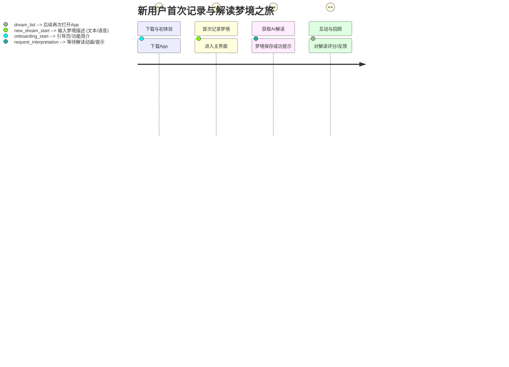
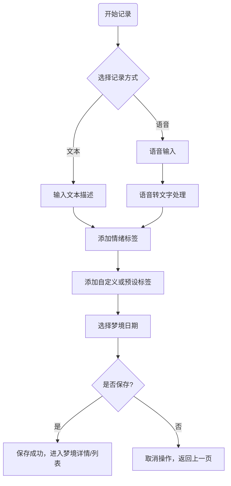
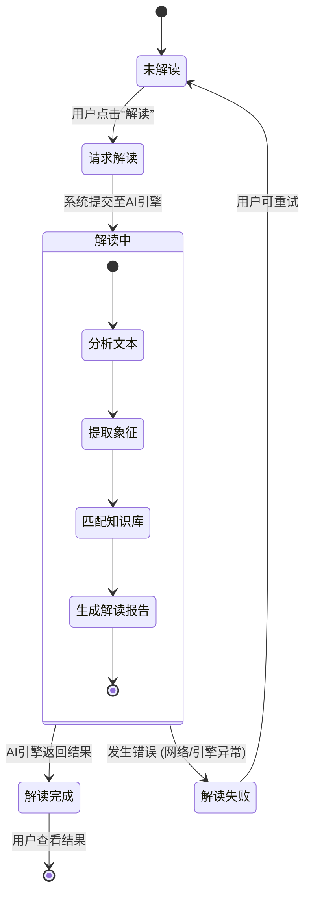

# 产品需求文档 (PRD) - Dream Interpreter

## 1. 文档信息

### 1.1 版本历史

| 版本号 | 修订日期   | 修订人 | 修订说明         |
| ------ | ---------- | ------ | ---------------- |
| 0.1    | YYYY-MM-DD | 产品经理 | 初稿创建         |

### 1.2 文档目的

本文档旨在明确“Dream Interpreter”移动应用的产品需求，作为产品设计、开发、测试和运营的依据，确保各方对产品有统一的理解和目标。

### 1.3 相关文档引用

- [产品路线图 (Roadmap)](./Roadmap.md)
- [用户故事地图 (User Story Map)](./User_Story_Map.md)
- [产品评估指标框架 (Metrics Framework)](./Metrics_Framework.md)

## 2. 产品概述

### 2.1 产品名称与定位

- **产品名称：** Meadow Dream
- **产品定位：** 一款帮助用户记录、分析和理解梦境，提供个性化解读、积极心理引导和幸福感提升（wellness）支持的iOS移动应用。

### 2.2 产品愿景与使命

- **产品愿景：** 成为用户探索潜意识、促进自我认知、引导积极心态、提升整体幸福感（wellness）的可靠伙伴。
- **产品使命：** 通过便捷的梦境记录、专业的AI解读以及积极的梦境引导与预测，帮助用户从梦境中获得有价值的洞察，并迈向更积极的心理状态。

2.3 价值主张与独特卖点(USP)
- **核心价值：** 通过便捷的记录（文本与**语音**）、专业的AI解读（**手动触发**）、**积极的心理引导（Wellness Focus）**以及个性化的**标签管理**，帮助用户探索梦境的奥秘，理解潜意识信息，获得个人成长和心理慰藉，提升幸福感。
- **独特卖点：**
    - **深度个性化解读与引导：** 结合用户情绪、标签和可选的现实情境，提供超越通用解梦的个性化分析，并在需要时主动提供积极的心理支持和行动建议，促进用户心理健康。
    - **便捷高效的梦境记录：** 支持文本和**语音转文字**输入，配合**标签库**快速标记，轻松捕捉每一个梦境细节。
    - **用户掌控的解读时机：** 梦境解读功能**完全由用户手动触发**，给予用户充分的隐私和自主权。
    - **聚焦积极成长 (Wellness)：** 强调从梦境中汲取智慧，通过积极引导帮助用户改善情绪，提升生活质量。
    - **安全可靠的用户系统：** 采用 **Firebase** 进行用户认证与数据管理，保障用户数据安全。
    - **用户友好的体验：** 简洁直观的界面设计，流畅的记录和交互过程。
    - **持续学习的AI：** 基于用户反馈不断优化的解读模型，越来越懂你。

2.4 目标平台列表: **iOS (Swift)**

### 2.5 产品核心假设

- 用户对自己的梦境感到好奇，并希望理解其含义。
- 用户愿意在移动应用上记录和分享（可选）自己的梦境信息。
- 通过有效的梦境解读，可以帮助用户缓解困惑、获得启发或情感支持。

### 2.6 商业模式概述 (如适用)

- **免费增值 (Freemium) 模型为主：**
    - **免费功能：**
        - 基础的梦境记录（每日次数限制或总数限制）。
        - 基于通用词典或基础算法的梦境解读（每日次数限制）。
        - 梦境日历和基础统计。
    - **付费增值服务 (通过订阅解锁)：**
        - 无限制的梦境记录。
        - 高级/深度梦境解读（调用更复杂的AI模型、多维度分析、个性化解读）。
        - 详细的梦境模式分析报告（例如，情绪波动、常见主题、象征物关联等）。
        - 语音转文字记录梦境。
        - 导出梦境数据。
        - 去除应用内广告（如果免费版包含广告）。
        - （可选）与专业心理咨询师的初步连接或优惠。
- **轻度广告 (可选，针对免费用户)：** 在不影响核心用户体验的位置（例如，解读结果页底部、设置页等）展示少量广告，作为免费服务的补充收入。需谨慎设计，避免用户反感。
- **一次性内购 (可选，作为订阅的补充)：** 例如，购买特定主题的深度解读包，或解锁特定的高级功能模块。

## 3. 用户研究

### 3.1 目标用户画像 (详细)

#### 3.1.1 人口统计特征

- **年龄段：** 18-45岁为主，覆盖对自我探索、心理成长有较高兴趣的年轻及中年群体。
- **性别：** 女性用户可能略多于男性，但对两性用户均有吸引力。
- **教育程度：** 大专及以上学历用户占比较高，对新事物接受度高，乐于使用移动应用解决问题或获取信息。
- **职业：** 学生、白领、自由职业者、艺术创作者、心理学爱好者等，有一定闲暇时间进行自我反思和记录。
- **地理位置：** 城市用户为主，对心理健康和个人成长话题关注度较高。

#### 3.1.2 行为习惯与偏好

- **科技产品使用：** 熟练使用智能手机和各类App，对设计良好、体验流畅的应用有较高要求。
- **信息获取：** 习惯通过互联网获取信息，对心理学、星座、占卜、个人成长等内容有兴趣。
- **社交媒体：** 可能活跃于社交媒体，但对于私密的梦境内容，更倾向于在安全的环境下记录和解读，分享意愿因人而异。
- **生活方式：** 注重生活品质和精神世界，愿意为有价值的知识或服务付费。
- **解梦习惯：** 可能尝试过通过搜索引擎、书籍或向他人请教来解读梦境，但缺乏系统、便捷、私密的工具。

#### 3.1.3 核心需求与痛点

- **核心需求：**
    - 理解自己光怪陆离的梦境到底意味着什么。
    - 通过梦境了解自己潜意识的想法、担忧或渴望。
    - 获得情感上的慰藉、启发或指引。
    - 记录下那些重要或有趣的梦，避免遗忘。
    - 寻找一种私密且便捷的方式来探索内心世界。
- **痛点：**
    - 梦境易逝，醒来后很快忘记细节，无法有效记录。
    - 网络上的解梦信息繁杂、质量参差不齐，缺乏权威性和个性化。
    - 向他人述说私密梦境可能感到尴尬或不安全。
    - 传统的解梦书籍查询不便，内容固定，无法互动。
    - 对自己的某些重复出现的梦境感到困惑或焦虑，不知如何应对。

#### 3.1.4 动机与目标

- **自我探索与认知：** 希望通过梦境这扇窗户更深入地了解自己的内心世界、潜意识需求和未被察觉的情绪。
- **寻求答案与指导：** 对于生活中的困惑、压力或重要抉择，期望从梦境中获得一些启示或方向性的指引。
- **情感抒发与慰藉：** 将梦境作为一种情感的出口，通过记录和解读来处理复杂的情绪，获得心理上的安慰。
- **好奇心与趣味性：** 单纯对神秘的梦境世界感到好奇，享受探索和解读的乐趣。
- **个人成长：** 将梦境分析作为一种自我提升的工具，促进心理成熟和应对能力的增强。

#### 3.1.1 人口统计特征
#### 3.1.2 行为习惯与偏好
#### 3.1.3 核心需求与痛点
#### 3.1.4 动机与目标

### 3.2 用户场景分析

3.2.1 核心使用场景详述
    -   **场景1：快速记录刚醒来的梦境 (语音优先)**
        -   用户A刚睡醒，对一个印象深刻的梦境记忆犹新。她迅速打开“Meadow Dream” App，**优先使用语音输入**快速记录下梦境的关键情节、人物和情绪，系统自动将语音转换为文字。随后，她可能会从**标签库**中选择或快速添加几个核心标签。她希望在记忆消退前捕捉到尽可能多的细节。
    -   **场景2：睡前整理与回顾当日梦境 (文本编辑与标签完善)**
        -   用户B习惯在睡前花点时间回顾和整理白天的思绪。如果白天做了梦并有初步记录（可能是语音），他会打开App，仔细编辑和完善梦境的文字描述，从**标签库**中挑选更准确的标签，或创建新的自定义标签，并思考是否需要**手动触发AI解读**。
    -   **场景3：寻求对困惑梦境的解读与积极引导 (手动触发AI，关注Wellness)**
        -   用户C最近经常做一个相似的、令他感到焦虑的梦。他在App中找到这条记录，**手动点击“解读梦境”**。他期望AI的分析不仅能揭示梦境的可能含义，更能**提供积极的心理引导和应对策略，帮助他缓解焦虑情绪，实现Wellness目标。**
    -   **场景4：通过梦境进行自我探索与成长 (结合解读与个人反思)**
        -   用户D对心理学和自我探索感兴趣。她定期使用App记录和解读自己的梦境，将AI的解读（包含积极引导）作为一种参考，结合自己的生活经验进行反思，尝试理解潜意识的信号，促进个人成长和情绪管理。
    -   **场景5：管理个人标签库与回顾**
        -   用户E使用App一段时间后，希望整理自己的梦境标签。她进入**标签库管理**界面，查看系统预设标签和自己创建的自定义标签，可能会编辑或删除一些不再常用的自定义标签，使标签系统更符合个人习惯，方便回顾和查找特定主题的梦境。

#### 3.2.2 边缘使用场景考量

1.  **场景：快速捕捉灵感**
    *   用户可能在非睡眠状态下，由某个梦境片段引发了创作灵感，希望快速记录下来。
2.  **场景：与心理咨询师分享（需用户主动操作且有此意愿）**
    *   用户如果正在接受心理咨询，可能会希望将整理后的梦境记录导出或截图，分享给自己的咨询师作为参考。
3.  **场景：纯粹的娱乐和消遣**
    *   部分用户可能并非带着强烈的自我探索目的，而是将解梦作为一种有趣的消遣方式。
4.  **场景：学习梦境知识**
    *   用户可能对梦境心理学本身感兴趣，希望通过App了解更多相关的知识或理论。

#### 3.2.1 核心使用场景详述
#### 3.2.2 边缘使用场景考量

### 3.3 用户调研洞察 (如适用)

*(待补充)*

## 4. 市场与竞品分析

### 4.1 市场规模与增长预测

- **心理健康市场持续增长：** 全球范围内，大众对心理健康的关注度日益提升，相关产品和服务市场规模持续扩大。解梦作为心理探索的一个分支，受益于此大趋势。
- **移动健康应用普及：** 用户越来越习惯通过移动应用获取健康管理服务，包括心理健康支持。解梦App作为细分品类，有其发展空间。
- **个性化需求增加：** 用户对通用型信息的需求降低，对个性化、定制化的内容和服务需求增加，这为提供智能分析和个性化解读的解梦App带来机会。
- *具体市场数据需结合第三方市场研究报告进行补充。*

### 4.2 行业趋势分析

- **AI技术赋能：** 人工智能（特别是自然语言处理NLP和机器学习ML）在文本分析、情感识别、模式匹配等方面的应用，为解梦提供了更智能、更高效的技术手段。
- **数据隐私与伦理关注：** 随着数据应用的深入，用户对个人隐私保护的意识增强，解梦App需要高度重视数据安全和伦理规范。
- **内容与服务结合：** 单纯的工具型App竞争激烈，结合优质内容（如心理学科普、梦境故事）、社群互动或专业咨询服务，是提升用户粘性和价值的重要方向。
- **注重科学性与趣味性的平衡：** 用户既希望解梦具有一定的科学依据或理论支撑，也追求探索过程的趣味性和启发性。

### 4.3 竞争格局分析

#### 4.3.1 直接竞争对手详析

*(需要调研市面上主流的解梦App，例如：周公解梦类App、国外的一些基于心理学理论的解梦App等。分析其优劣势、主要功能、用户评价、商业模式等)*

- **示例竞品A (名称)：**
    - **优势：** 用户基数大，内容覆盖广（传统解梦词条多）。
    - **劣势：** 解读较为刻板，缺乏个性化，用户体验和界面设计可能较为陈旧，广告较多。
    - **定价：** 免费+广告 / VIP去广告。
    - **特性：** 关键词搜索解梦。
- **示例竞品B (名称)：**
    - **优势：** 界面现代，可能引入一些心理学概念，解读相对更灵活。
    - **劣势：** 用户量可能不如传统App，AI能力有限，深度个性化不足。
    - **定价：** 免费试用+订阅。
    - **特性：** 梦境日记，情绪追踪。

#### 4.3.2 间接竞争对手概述

- **通用日记类App：** 部分用户可能使用通用日记App记录梦境，但缺乏专业的解读功能。
- **心理咨询平台/服务：** 提供更专业的心理支持，但成本较高，便捷性不如App。
- **搜索引擎/在线解梦网站：** 用户获取解梦信息的传统渠道，但信息质量不一，缺乏私密性和持续记录能力。
- **占卜/星座类App：** 满足用户对神秘事物的好奇心和对未来的探索欲，与解梦App在用户心理需求上有一定重叠。

### 4.4 竞品功能对比矩阵

| 功能点             | Dream Interpreter (本产品) | 竞品A | 竞品B | 竞品C |
| ------------------ | -------------------------- | ----- | ----- | ----- |
| 梦境记录方式       | 文本、语音、标签、情绪     | 文本  | 文本、情绪 | ...   |
| 解读引擎           | AI多维度、个性化学习       | 词条匹配 | 基础算法 | ...   |
| 个性化解读         | 支持                       | 不支持 | 有限支持 | ...   |
| 梦境模式分析       | 支持 (高级功能)            | 不支持 | 不支持 | ...   |
| 隐私保护强调       | 高                         | 一般  | 一般  | ...   |
| 社区互动           | 远期规划                   | 无    | 可能有 | ...   |
| 商业模式           | Freemium (订阅为主)        | 广告  | 订阅  | ...   |
| 用户体验           | 简洁、引导式               | 陈旧  | 现代  | ...   |

*(待详细调研后补充完整)*

4.5 市场差异化策略
- **深度个性化解读与积极心理引导 (Wellness Focus)：** 强调AI解读的深度、多维度分析，并结合用户个体情况。更重要的是，主动提供积极的心理支持和行动建议，将产品定位为促进用户心理健康的伙伴，这是与传统解梦应用的关键区别。
- **高效便捷的记录与管理体验 (语音输入与标签库)：** 提供流畅的文本和语音转文字输入，配合强大的预设与自定义标签库，使用户能轻松高效地捕捉和组织梦境信息。
- **用户自主与隐私安全 (手动触发与Firebase)：** 梦境解读完全由用户手动触发，充分尊重用户隐私和自主选择权。依托Firebase提供安全可靠的用户认证和数据存储。
- **专注iOS平台的精致体验 (Swift原生)：** 初期聚焦iOS平台，利用Swift原生开发优势，打造高质量、高性能、符合iOS生态体验的精品应用。

### 4.1 市场规模与增长预测
### 4.2 行业趋势分析
### 4.3 竞争格局分析
#### 4.3.1 直接竞争对手详析
#### 4.3.2 间接竞争对手概述
### 4.4 竞品功能对比矩阵
### 4.5 市场差异化策略

## 5. 产品功能需求

### 5.1 功能架构与模块划分

```mermaid
graph TD
    A[Dream Interpreter App] --> B(用户账户模块);
    A --> C(梦境记录模块);
    A --> D(梦境解读模块);
    A --> E(我的梦境管理模块);
    A --> F(数据与统计模块);
    A --> G(设置与帮助模块);
    A --> H(高级功能模块);

    B --> B1(注册);
    B --> B2(登录);
    B --> B3(账户设置);
    B --> B4(个人资料管理);

    C --> C1(新建梦境记录);
    C --> C2(文本输入);
    C --> C3(语音输入转文字);
    C --> C4(情绪标记);
    C --> C5(关键词/标签添加);
    C --> C6(梦境时间/日期选择);

    D --> D1(请求解读);
    D --> D2(AI解读引擎);
    D --> D3(多维度分析呈现);
    D --> D4(解读结果展示);
    D --> D5(用户反馈与评价);
    D --> D6(相关符号/主题延展阅读);

    E --> E1(梦境列表);
    E --> E2(梦境日历视图);
    E --> E3(搜索与筛选);
    E --> E4(编辑/删除梦境);
    E --> E5(收藏梦境/解读);

    F --> F1(基础梦境统计);
    F --> F2(梦境模式分析 - 高级);
    F --> F3(情绪趋势图 - 高级);

    G --> G1(通知设置);
    G --> G2(隐私设置);
    G --> G3(帮助中心/FAQ);
    G --> G4(关于我们);
    G --> G5(反馈与建议);

    H --> H1(订阅管理);
    H --> H2(高级解读解锁);
    H --> H3(数据导出 - 高级);
    H --> H4(专业咨询入口 - 可选远期);
```

**模块说明：**

-   **用户账户模块：** 负责用户身份认证与管理。
-   **梦境记录模块：** 提供便捷的梦境信息输入功能。
-   **梦境解读模块：** 核心功能，对用户记录的梦境进行分析并给出解读。
-   **我的梦境管理模块：** 用户查看、管理和回顾已记录梦境的中心。
-   **数据与统计模块：** 为用户提供关于其梦境的统计信息和模式分析。
-   **设置与帮助模块：** 提供应用设置、用户支持等功能。
-   **高级功能模块：** 主要承载付费订阅解锁的功能。

### 5.2 核心功能详述

5.2.1 **梦境记录与管理 (Dream Recording & Management)**
-   **功能描述 (用户故事格式优先: 作为 [用户类型], 我想要 [完成某事], 以便 [获得价值])**
    -   作为一名用户，我想要通过文本或**语音输入（自动转换为文字）**的方式记录下我的梦境内容、相关情绪和关键元素，以便后续回顾和分析。
    -   作为一名用户，我想要方便地编辑、删除和搜索我记录的梦境。
    -   作为一名用户，我想要通过日历视图快速定位和浏览特定日期的梦境。
    -   作为一名用户，我想要为我的梦境添加自定义标签或从**预设标签库**中选择标签，方便分类和检索。
    -   作为一名用户，我想要通过语音输入快速记录梦境，尤其是在刚睡醒意识模糊时，以便更高效地捕捉梦境细节。
-   **用户价值:** 便捷地捕捉和组织梦境信息，为后续的分析和回顾打下基础。
-   **功能逻辑与规则:** 
        1.  用户可以创建新的梦境记录。
        2.  支持文本输入和语音输入（需转换为文字存储）。
        3.  允许用户标记梦境发生时的情绪（如开心、困惑、恐惧等）。
        4.  用户可以为梦境添加多个标签，标签可以来自系统预设的标签库，也可以由用户自定义创建并添加入个人标签库。
        5.  记录自动保存日期和时间。
        6.  提供编辑和删除已记录梦境的功能。
        7.  支持按关键词、日期、标签、情绪等条件搜索梦境。
        8.  提供日历视图，方便用户按日期查看梦境。
-   **交互要求:** 输入过程流畅，标签选择方便，日历视图直观。
-   **数据需求:** 梦境文本、语音文件路径（临时）、转换后的文本、情绪数据、标签数据、记录时间。
-   **技术依赖:** iOS语音识别API (SFSpeechRecognizer for Swift)、本地数据库 (如 Core Data or Realm) 或 Firebase Firestore。
-   **验收标准:** 文本和语音记录功能可用。标签系统（预设与自定义）可用。梦境的增删改查功能符合预期。日历视图正确显示。

5.2.2 **AI梦境解读与积极引导 (AI Dream Interpretation & Positive Guidance)**
-   **功能描述:** 用户可以**手动触发**对已记录梦境的AI解读。AI将基于心理学、符号学、文化象征以及用户提供的上下文信息（如情绪、近期事件——如果用户选择提供），生成对梦境可能含义的多维度分析和解释。**特别地，当分析结果暗示用户可能存在焦虑或负面情绪时，系统将主动提供积极的心理暗示、应对策略和正向思考引导，帮助用户将梦境启示转化为积极的现实行动，实现wellness目标。**
-   **用户价值:** 获得对梦境的深度理解，探索潜意识信息，获取心理启示，并在需要时获得积极的心理支持和引导，提升幸福感。
-   **功能逻辑与规则:**
    1.  用户选择一条梦境记录，点击“解读梦境”按钮。
    2.  系统将梦境文本、用户标签、情绪等信息（经用户同意）发送至AI解读引擎。
    3.  AI引擎进行分析，结合知识库（心理学理论、符号象征、文化原型等）和机器学习模型，生成解读报告。
    4.  解读报告应包含：梦境主题概括、关键符号分析、可能的情感联系、潜在的现实关联。
    5.  **针对识别出的负面情绪或焦虑情境，解读报告将包含“积极引导与建议”模块，提供具体的、可操作的积极思考方向、应对技巧或放松练习建议。**
    6.  用户可以对解读结果及引导建议进行评价（如“有帮助”，“不准确”），反馈将用于优化AI模型。
-   **交互要求:** 解读结果清晰易懂，排版友好，重要信息突出。积极引导部分应以温和、鼓励的语气呈现。提供反馈入口。
-   **数据需求:** 梦境文本、标签、情绪数据、用户反馈数据、AI模型训练数据、积极心理引导策略库。
-   **技术依赖:** 自然语言处理(NLP)技术、机器学习(ML)平台、梦境解读知识库、积极心理引导知识库、Firebase (用于可能的云函数处理和用户数据关联)。
-   **验收标准:** 解读结果在30秒内返回。解读内容应包含至少3个维度的分析。当梦境内容涉及负面情绪时，必须提供积极引导模块。用户反馈功能可用。

5.2.3 **标签库管理 (Tag Library Management)**
-   **功能描述:** 用户可以查看和管理自己的标签库，包括系统预设标签和用户自定义标签。用户可以创建新标签、编辑现有标签名称、删除不再使用的自定义标签。系统预设标签不可删除或编辑，但用户可以选择是否在自己的常用标签列表中显示它们。
-   **用户价值:** 帮助用户更有效地组织和分类梦境，提升检索效率，个性化梦境管理体验。
-   **功能逻辑与规则:**
    1.  提供标签库入口，展示所有可用标签（系统预设 + 用户自定义）。
    2.  用户可以添加新的自定义标签。
    3.  用户可以编辑自定义标签的名称。
    4.  用户可以删除自定义标签（若标签仍被梦境使用，应有提示或处理机制，如解除关联）。
    5.  系统预设标签列表由应用维护，用户不可修改其内容，但可控制其在标签选择器中的可见性或优先级。
    6.  标签可以有关联的梦境数量统计。
-   **交互要求:** 标签列表清晰，操作便捷。创建和编辑标签的流程简单明了。
-   **数据需求:** 标签ID、标签名称、标签类型（系统/自定义）、创建时间、关联梦境数。
-   **技术依赖:** 本地数据库 (如 Core Data or Realm) 或 Firebase Firestore。
-   **验收标准:** 用户能够成功创建、编辑、删除自定义标签。系统预设标签按预期展示。标签能正确关联到梦境。

##### 5.2.4 [功能模块4] 梦境统计与模式分析

-   **功能描述：**
    -   作为一名用户，我想要查看我记录的梦境的一些统计数据，比如最常出现的情绪、最常用的标签、梦境数量的趋势等。
    -   作为一名用户，我希望App能帮我分析我梦境中可能存在的模式或关联，比如某些主题是否总在特定情绪下出现。
-   **用户价值：** 从宏观层面了解自己的梦境特点和变化趋势，发现更深层次的潜意识模式。
-   **功能逻辑与规则：**
    -   统计用户记录的梦境总数、平均每周/每月记录数。
    -   统计不同情绪标签出现的频率和占比，并可视化展示（如饼图、柱状图）。
    -   统计不同关键词标签出现的频率和占比，并可视化展示。
    -   （高级功能）分析常见梦境主题（通过NLP识别或用户标签）。
    -   （高级功能）分析情绪与主题、情绪与标签之间的关联性。
    -   （高级功能）提供梦境回顾报告，总结一段时间内的梦境特点和变化。
-   **交互要求：**
    -   统计图表清晰易懂，视觉友好。
    -   用户可以自定义统计的时间范围。
-   **数据需求：**
    -   基于用户所有梦境记录的聚合统计数据。
-   **技术依赖：**
    -   数据分析和可视化库/组件。
-   **验收标准：**
    -   统计数据准确无误。
    -   图表能正确反映统计结果。
    -   用户可以按不同维度查看统计信息。

### 5.3 次要功能描述

-   **用户账户管理：**
    -   **功能：** 用户注册、登录（手机/邮箱/第三方）、密码找回、个人资料修改（昵称、头像）。
    -   **价值：** 保障用户数据安全与个性化体验。
-   **设置与帮助：**
    -   **功能：** 通知开关（如每日记录提醒）、隐私设置（如数据同步开关）、帮助中心/FAQ、关于我们、用户反馈渠道、版本信息。
    -   **价值：** 提供用户自定义选项和必要的支持。
-   **数据导出（高级功能）：**
    -   **功能：** 订阅用户可将自己的梦境数据导出为特定格式（如JSON, CSV）。
    -   **价值：** 给予用户数据所有权，满足高级用户的数据备份或进一步分析需求。
-   **主题换肤：**
    -   **功能：** 提供多种应用界面主题供用户选择（如暗色模式、不同色系）。
    -   **价值：** 提升个性化体验和视觉舒适度。

### 5.4 未来功能储备 (Backlog)

-   **匿名梦境分享社区：**
    -   **描述：** 用户可选择将自己的梦境（经脱敏处理）匿名分享到社区，浏览他人的梦境，进行点赞、评论（友好型）等互动。
    -   **价值：** 增强用户粘性，满足用户的分享和连接需求，从他人梦境中获得启发。
    -   **考量：** 需严格的内容审核机制和社区管理规范，保护用户隐私和社区氛围。
-   **专业心理咨询师对接（可选）：**
    -   **描述：** 为有需要的用户提供付费的、与专业心理咨询师就梦境进行深入交流的入口或推荐服务。
    -   **价值：** 拓展服务深度，满足用户更专业的心理支持需求，探索新的商业模式。
    -   **考量：** 需严格筛选合作咨询师资质，明确服务边界和责任。
-   **清明梦/控梦辅助工具：**
    -   **描述：** 提供一些关于清明梦（Lucid Dream）的知识科普，以及辅助练习工具（如现实检验提醒、梦境触发音效等）。
    -   **价值：** 满足特定用户群体对探索梦境控制能力的兴趣。
    -   **考量：** 功能的科学性和有效性需谨慎评估。
-   **梦境意象库/词典：**
    -   **描述：** 建立一个可供用户查询的、包含常见梦境意象及其可能象征意义的数据库，结合文化、心理学等多角度解释。
    -   **价值：** 作为AI解读的补充，提供更丰富的参考信息。
-   **与其他健康App数据联动：**
    -   **描述：** 在用户授权下，与睡眠监测、情绪追踪等健康App进行数据打通，综合分析用户身心状态与梦境的关系。
    -   **价值：** 提供更全面的健康洞察。
    -   **考量：** 数据隐私和安全是首要问题。

## 6. 用户流程与交互设计指导

### 6.1 核心用户旅程地图

*(以新用户首次记录并解读梦境为例)*

### 6.2 关键流程详述与状态转换图

#### 6.2.1 梦境记录流程

#### 6.2.2 AI解读流程

6.3 对设计师 (UI/UX Agent) 的界面原型参考说明和要求 (例如强调关键信息、操作焦点等)
- **梦境记录界面：**
    -   输入区域清晰，支持文本和**语音输入按钮/切换**。
    -   情绪和**标签（可从标签库选择或新建）**选择直观、便捷。
    -   保存按钮明确。**“解读梦境”按钮应在梦境详情页或列表项中，而非记录界面。**
- **梦境列表/日历界面：**
    -   信息密度适中，关键信息（日期、标题、主要情绪/标签）一目了然。
    -   日历视图应能清晰标记有记录的日期。
    -   列表项应包含**手动触发“解读梦境”的入口**。
- **梦境详情与解读界面：**
    -   梦境原文与解读内容区分清晰，排版易读。
    -   **积极引导（Wellness）**部分应以鼓励和支持的视觉风格呈现，内容温和且具有建设性。
    -   反馈入口易于发现和操作。
- **标签库管理界面：**
    -   标签列表清晰，区分系统预设标签和用户自定义标签。
    -   添加、编辑、删除自定义标签的操作符合常规iOS交互习惯。
    -   提供搜索标签功能。
- **用户注册/登录界面 (Firebase Auth):**
    -   遵循Firebase Authentication的最佳实践和UI指导原则，提供邮箱/密码登录以及可能的社交登录选项（如Sign in with Apple, Sign in with Google）。
    -   界面简洁，流程顺畅，注重用户隐私和安全提示。

### 6.4 交互设计规范与原则建议

-   **一致性：** 应用内的操作方式、图标、术语应保持一致。
-   **反馈及时：** 用户的所有操作都应有即时的视觉或听觉反馈（如按钮按下效果、加载提示、操作成功提示）。
-   **容错性：** 允许用户撤销误操作（如删除梦境前的确认），提供清晰的错误提示和解决指引。
-   **易学性：** 功能设计直观，减少用户学习成本。复杂功能提供引导。
-   **效率优先：** 常用操作路径应尽可能短，减少不必要的点击和等待。
-   **可访问性：** 考虑不同用户的需求，例如提供足够的色彩对比度，支持字体大小调整（遵循系统设置）。
-   **情感化设计：** 适当融入能引起用户积极情感共鸣的元素（如温馨的插画、鼓励性的文字），营造良好的使用氛围。

## 7. 非功能需求

7.1 性能需求 (响应时间、并发量、稳定性、资源使用率等)
- 梦境记录保存（本地/Firebase）：< 1秒。
- **iOS语音转文字 (SFSpeechRecognizer)：实时性要求高，转写延迟应尽可能低，理想情况下用户说话结束后台即开始处理，短语音 < 2秒内完成。**
- AI梦境解读（手动触发）：核心功能，首次解读 < 30秒，后续优化目标 < 15秒（需考虑网络状况和AI引擎负载）。
- 列表加载：< 2秒。
- 应用启动时间：< 3秒。
- **Firebase操作：所有与Firebase的交互（认证、数据读写）应有超时和错误处理机制，确保在网络不佳时应用不会卡死，并给予用户适当提示。**

7.2 安全需求 (数据加密、认证授权、隐私保护、防攻击策略等)
- **用户认证：通过Firebase Authentication实现安全的身份验证。**
- 用户数据（特别是梦境内容、个人信息）在传输（HTTPS）和存储时必须加密（例如Firebase Firestore默认的服务器端加密）。
- 严格的隐私政策，明确数据使用范围，用户对自己的数据有控制权（例如数据导出、账户删除）。
- **遵守Apple的隐私指南和App Store审核要求。**
- 防止未授权访问和数据泄露，利用Firebase的安全规则来控制数据访问权限。
- AI解读引擎的输入输出需进行安全过滤，防止恶意注入。

### 7.3 可用性与可访问性标准

-   界面简洁易懂，操作便捷。
-   考虑视障、听障等用户的可访问性需求。

### 7.4 合规性要求

-   遵守目标市场的法律法规，特别是数据隐私和心理健康相关的规定。

7.5 数据统计与分析需求 (需要埋点跟踪的关键事件和指标)
- 用户注册（通过Firebase）、登录（通过Firebase）、日活、月活。
- 梦境记录频率、平均长度、**文本记录与语音记录的比例**、常用情绪/标签。
- **标签库使用情况：自定义标签创建数、预设标签使用频率。**
- AI解读功能使用率（手动触发次数）、解读满意度反馈、**积极引导内容的有效性反馈（如有）。**
- 付费转化率、订阅用户留存率（如果未来引入付费功能）。
- **核心Wellness指标：例如用户自我报告的情绪改善频率（可通过定期小问卷或引导性问题收集）。**

## 8. 技术架构考量

8.1 技术栈建议 (如适用，或提出约束条件)
- **iOS端：Swift**
- 后端：根据团队熟悉度和需求选择，如 Python (Django/Flask), Node.js (Express), Ruby on Rails, Go 等。Firebase Cloud Functions 也是一个选项，用于处理需要后端逻辑的部分。
- 数据库：Firebase Firestore 或 Firebase Realtime Database。
- AI/ML：Python (TensorFlow, PyTorch, scikit-learn), 相关云服务 (如 Google AI Platform, AWS SageMaker), 或 Firebase ML Kit (如果适用)。
- **用户认证与登录：Firebase Authentication**

8.2 系统集成需求 (与其他系统交互的要求)
- **Firebase Ecosystem:**
    -   **Firebase Authentication:** 用于处理用户注册、登录（邮箱/密码、Apple Sign-In, Google Sign-In等）。
    -   **Firebase Firestore/Realtime Database:** 用于存储用户数据、梦境记录、标签等。
    -   **Firebase Cloud Functions:** 可能用于处理AI解读请求的转发、数据后台处理等。
    -   **Firebase ML Kit:** (如果其能力满足需求) 可用于部分设备端AI功能。
    -   **Firebase Analytics:** 用于用户行为追踪和分析。
- （可选）支付网关 (通过Apple App Store内购机制处理订阅和内购)。

8.3 技术依赖与约束 (如必须使用的库、服务、性能限制等)
- 依赖可靠的NLP和ML库/服务进行梦境文本分析和积极引导内容生成。
- 确保数据存储和传输的安全性，符合隐私法规要求，特别是使用云服务时。
- **iOS平台特性：充分利用iOS平台的语音识别API (SFSpeechRecognizer) 实现语音转文字。**
- **深度集成Firebase SDK。**

8.4 数据模型建议 (关键实体的属性和关系)
- **用户 (User):**
    -   `userID` (Firebase UID, String, Primary Key)
    -   `email` (String, Nullable)
    -   `displayName` (String, Nullable)
    -   `createdAt` (Timestamp)
    -   `subscriptionStatus` (String, e.g., "free", "premium")
    -   `settings` (Map, e.g., {notificationsEnabled: true})
- **梦境 (Dream):**
    -   `dreamID` (String, Primary Key, Auto-generated)
    -   `userID` (String, Foreign Key to User.userID)
    -   `title` (String, Optional)
    -   `text` (String, Content of the dream)
    -   `audioFilePath` (String, Optional, path to local/cloud storage if voice memo saved)
    -   `emotions` (Array of Strings, e.g., ["happy", "anxious"])
    -   `tagIDs` (Array of Strings, Foreign Keys to Tag.tagID)
    -   `recordedAt` (Timestamp)
    -   `updatedAt` (Timestamp)
    -   `interpretation` (Map, Optional, see Interpretation sub-model)
- **标签 (Tag):**
    -   `tagID` (String, Primary Key, Auto-generated or predefined for system tags)
    -   `userID` (String, Nullable, Foreign Key to User.userID for custom tags, null for system tags)
    -   `name` (String, e.g., "flying", "exam")
    -   `isSystemTag` (Boolean)
    -   `usageCount` (Integer, Optional, for analytics)
- **解读 (Interpretation) (Sub-model within Dream):**
    -   `interpretationText` (String)
    -   `positiveGuidanceText` (String, Optional)
    -   `generatedAt` (Timestamp)
    -   `modelVersion` (String, Optional)
    -   `userFeedback` (Map, Optional, e.g., {rating: 5, comment: "Helpful"})

## 9. 验收标准汇总

9.1 功能验收标准矩阵 (汇总功能点的验收标准)
    - 此处应有一个表格，列出主要功能点及其核心验收标准，例如：
        | 功能模块         | 核心功能点                     | 验收标准 (示例)                                                                 |
        |------------------|--------------------------------|---------------------------------------------------------------------------------|
        | **用户账户 (Firebase)** | 邮箱/密码注册与登录            | 用户可以通过邮箱和密码成功注册并登录“Meadow Dream”应用。                               |
        |                  | (可选) 第三方登录 (Apple/Google) | 用户可以通过Apple ID或Google账户成功登录。                                             |
        | **梦境记录与管理** | 文本记录                       | 用户可以输入并成功保存梦境文本。                                                      |
        |                  | **语音记录与转文字 (iOS Swift)** | 用户可以录制语音，系统能通过SFSpeechRecognizer准确转换为文字，用户可编辑。                     |
        |                  | 情绪选择                       | 用户可以选择预设情绪并与梦境关联。                                                      |
        |                  | **标签添加 (从标签库/新建)**     | 用户可以从预设标签库选择标签，或创建自定义标签，并与梦境关联。                                |
        |                  | 查看/编辑/删除梦境             | 用户可以查看、编辑和删除已记录的梦境。                                                    |
        |                  | 日历视图                       | 梦境记录在日历视图中按日期正确标记和访问。                                                |
        | **标签库管理**   | 查看系统/自定义标签            | 用户可以清晰地查看到系统预设标签和用户个人创建的标签。                                      |
        |                  | 创建自定义标签                 | 用户可以成功创建新的自定义标签并保存到个人标签库。                                            |
        |                  | 编辑/删除自定义标签            | 用户可以成功编辑或删除自己的自定义标签。                                                    |
        | **AI梦境解读与积极引导 (Wellness)** | **手动触发解读**               | 用户可以对已选择的梦境记录手动发起解读请求。                                                |
        |                  | 解读结果呈现                   | 解读结果在30秒内展示，内容包含对梦境的多维度分析。                                        |
        |                  | **积极心理引导呈现**           | 当梦境内容暗示负面情绪时，解读结果必须包含清晰、温和、可操作的积极心理引导建议。                    |
        |                  | 解读反馈                       | 用户可以对解读结果（包括引导部分）进行评价（例如“有帮助”、“不准确”）。                               |
        | 非功能           | 性能 - 语音转文字延迟          | iOS语音转文字在常见场景下延迟 < 2秒。                                                     |
        |                  | 安全 - Firebase数据保护        | 用户数据通过Firebase安全规则得到保护，符合隐私政策。                                        |

### 9.2 性能验收标准

-   **应用启动时间：** 首次启动 < 5秒，后续启动 < 2秒。
-   **界面响应时间：** 主要界面切换和操作响应时间 < 500毫秒。
-   **列表加载速度：** 梦境列表（50条以内）加载时间 < 1秒。
-   **AI解读时间：** 平均解读时间 < 15秒（90%场景下）。
-   **资源占用：** 后台CPU占用率 < 5%，内存占用在合理范围内，无明显内存泄漏。
-   **稳定性：** ANR (Application Not Responding) / Crash 率 < 0.1%。

### 9.3 质量验收标准

-   **Bug密度：** 严重Bug（导致功能不可用、数据丢失、闪退）数量为0；主要Bug（影响核心流程、体验较差）数量 < 3个/版本。
-   **代码覆盖率：** 单元测试覆盖率 > 60%，关键模块 > 80%。
-   **兼容性：** 支持目标平台（iOS, Android）的主流设备和操作系统版本（近3个大版本）。
-   **用户体验：** 核心流程操作顺畅，无明显卡顿或逻辑断裂；界面美观，符合目标用户审美。
-   **数据准确性：** 梦境记录、解读结果、统计数据等信息准确无误。

## 10. 产品成功指标

10.1 关键绩效指标 (KPIs) 定义与目标
    -   **用户增长与活跃度 (iOS - Meadow Dream)：**
        -   **iOS平台下载量 (目标：MVP上线后3个月内达到X次)**
        -   日活跃用户数 (DAU) / 月活跃用户数 (MAU) (通过Firebase Analytics追踪，目标：DAU/MAU 达到 Y%)
        -   新用户注册成功率 (通过Firebase Authentication追踪，目标：> Z%)
        -   用户平均使用时长 (目标：A分钟/日)
        -   用户留存率 (次日、7日、30日留存，目标：分别达到 L%, M%, N%)
    -   **核心功能使用率：**
        -   **每日梦境记录数 / DAU (目标：B条/DAU)**
        -   **语音输入使用占比 (语音记录占总记录数的C%，衡量语音转文字功能的受欢迎程度)**
        -   **标签使用率 (平均每条梦境的标签数，目标：D个/条；自定义标签创建数；预设标签使用频率)**
        -   **手动触发AI解读次数 / DAU (目标：E次/DAU)**
        -   AI解读结果“有帮助”反馈占比 (目标：> F%)
        -   **积极心理引导内容“有帮助”反馈占比 (目标：> G%)**
    -   **Wellness与积极引导效果 (探索性)：**
        -   用户对“积极引导”内容的评价 (如通过问卷或特定反馈收集，目标：H%用户认为有积极影响)
        -   （长期）用户自我报告的情绪改善情况 (如通过应用内定期小调查，衡量与产品使用相关的积极变化，例如焦虑水平下降的比例)
    -   **商业化指标 (未来，如适用)：**
        -   (如推出Pro版) 付费转化率
        -   (如推出Pro版) Pro用户留存率
    -   **产品质量与口碑：**
        -   App Store评分 (目标：平均 I 星以上)
        -   用户推荐意愿 (NPS值，目标：达到 J)
        -   应用崩溃率 (通过Firebase Crashlytics追踪，目标：< K%)

10.2 北极星指标定义与选择依据
- **北极星指标：每周通过“Meadow Dream”完成至少一次“积极梦境互动”的用户数。**
    - **定义：** “积极梦境互动”指用户在“Meadow Dream”中完成以下任一组合行为：
        1.  记录梦境（文本或**语音**）并**至少添加一个标签**。
        2.  记录梦境并**手动触发AI解读**。
        3.  对AI解读结果中的**积极心理引导内容给出了正面反馈** (如“有帮助”)。
    - **选择依据：** 该指标综合反映了用户对“Meadow Dream”核心价值（便捷记录、个性化整理、深度解读、积极引导）的认可和深度使用。它超越了单纯的记录或解读次数，更强调用户与梦境内容及其意义的主动、积极的交互过程，这与产品“Wellness”和“积极心理引导”的定位高度契合。提升此指标意味着用户从产品中获得了实质性的价值和积极体验，有助于提升用户粘性和长期留存，并间接促进口碑传播和潜在的商业化机会。

### 10.3 指标监测计划

-   **数据收集工具：**
    -   集成移动应用数据分析平台（如Firebase Analytics, Mixpanel, Amplitude等）。
    -   后端服务器日志。
    -   用户反馈收集系统（应用内反馈、应用商店评论）。
-   **核心数据埋点：**
    -   用户行为事件：App启动、注册/登录、梦境记录（开始、保存）、请求解读、查看解读、解读反馈（评分）、订阅行为（点击、购买、取消）等。
    -   页面浏览事件：主要页面的PV/UV。
    -   错误与性能事件：Crash、ANR、API请求耗时、解读耗时等。
-   **报告与分析频率：**
    -   **每日：** 监控核心活跃指标、新增用户、Crash率等，及时发现异动。
    -   **每周：** 分析用户留存、核心功能使用趋势、付费转化等，评估版本效果和运营活动。
    -   **每月/每季度：** 深入分析用户行为模式、北极星指标达成情况、市场反馈，为产品迭代和战略调整提供依据。
-   **数据看板 (Dashboard)：**
    -   建立核心指标的可视化看板，方便团队成员实时了解产品表现。
-   **A/B 测试：**
    -   对于重要功能更新或UI调整，采用A/B测试验证效果，基于数据决策。